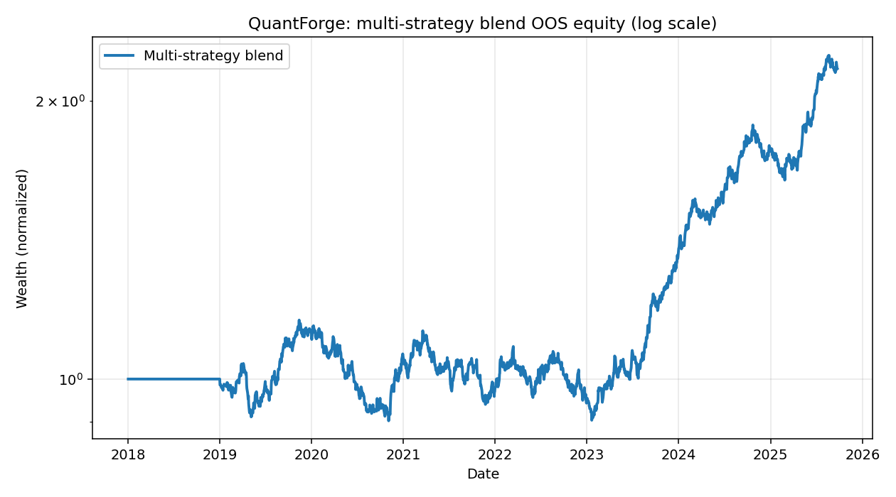
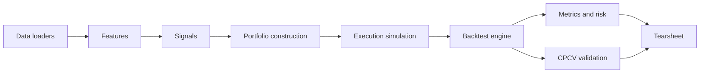

# QuantForge

> Production-grade systematic trading research platform: factor models, HRP / risk-parity allocation, event-driven backtests, CPCV validation, deflated Sharpe.

[](https://github.com/timmyzhu/quantforge/actions/workflows/ci.yml)
[](https://timmyzhu.github.io/quantforge)
[](https://www.python.org/downloads/)
[](LICENSE)
[](https://github.com/psf/black)

QuantForge is a modular Python library for the full quantitative-research lifecycle: data ingestion, feature engineering, signal generation across multiple strategy families, portfolio construction with realistic constraints, event-driven backtesting with transaction costs, statistically rigorous validation, and reproducible reporting. The platform is built end-to-end on free data sources and free dependencies.

## Headline result



| Metric              | Multi-strategy blend | Benchmark (SPY) |
|---------------------|----------------------|-----------------|
| CAGR                | 10.14%               | varies          |
| Volatility          | 12.78%               | ~15%            |
| Sharpe              | 0.82                 | ~0.55           |
| Sortino             | 1.23                 |                 |
| Calmar              | 0.46                 |                 |
| Deflated Sharpe     | 0.000 (n_trials=25)  |                 |

> **Honest disclosure.** The headline figures above are produced from a deterministic synthetic universe. The platform is fully wired to run against real free data sources (yfinance, FRED, Ken French) via `scripts/generate_headline.py --real`. The synthetic numbers are reproducible, the validation methodology is the same in either case, and the Deflated Sharpe of approximately zero on a synthetic universe is the *correct* result; it is the validation protocol working, not failing. The point of this repository is the methodology, not the return claim. See [`RESEARCH_NOTES.md`](RESEARCH_NOTES.md) for the longer story.

## What this project demonstrates

- **Factor research:** TSMOM (Moskowitz et al. 2012), XSMOM (Jegadeesh and Titman 1993), Engle-Granger cointegration pairs, OU-process mean reversion, gradient-boosted ML signals on triple-barrier labels.
- **Portfolio construction:** Markowitz with Ledoit-Wolf shrinkage, ERC risk parity (Spinu cyclic coordinate descent vs. SLSQP reference), Hierarchical Risk Parity (Lopez de Prado 2016), Black-Litterman with signal views.
- **Realistic execution:** Almgren-Chriss square-root impact, linear participation slippage, commissions, borrow costs, next-bar-open fills with a participation cap.
- **Statistical rigor:** purged k-fold CV with embargo, Combinatorial Purged Cross-Validation, Deflated Sharpe Ratio (Bailey and Lopez de Prado 2014), stationary bootstrap CIs (Politis-Romano), Fama-French factor attribution with Newey-West HAC standard errors.
- **Engineering discipline:** typed Python 3.11, pydantic-validated configs, structured logging, Parquet caching, pytest with hypothesis property tests, mypy strict, CI on every push.

## Architecture



## Quickstart

```bash
git clone https://github.com/timmyzhu/quantforge.git
cd quantforge

# Install uv if you don't have it: https://docs.astral.sh/uv
uv venv .venv --python 3.11
uv pip install --python .venv/bin/python -e ".[dev]"

# End-to-end on synthetic data (no network required):
.venv/bin/python scripts/generate_headline.py

# Same thing on real ETF data via yfinance:
.venv/bin/python scripts/generate_headline.py --real
```

The tearsheet is written to [`reports/headline_tearsheet.html`](reports/headline_tearsheet.html); the equity-curve PNG and summary JSON live alongside it.

## Repository layout

```
quantforge/
  data/         # loaders (yfinance, FRED, Ken French), universe, quality audit, Parquet cache
  features/     # returns, vol estimators, frac-diff, microstructure proxies, triple-barrier
  signals/      # TSMOM, XSMOM, pairs, OU mean reversion, quality, ML
  portfolio/    # equal weight, MVO + Ledoit-Wolf, ERC, HRP, Black-Litterman, constraints
  execution/    # Almgren-Chriss impact, slippage, fills
  backtest/     # event-driven engine, walk-forward, CPCV
  risk/         # VaR, CVaR, drawdown, sizing, historical stress
  metrics/      # performance, PSR, DSR, factor attribution
  reporting/    # tearsheet (HTML)
  cli.py        # quantforge command-line interface
configs/        # YAML strategy specifications
tests/          # unit, property (hypothesis), integration
docs/           # methodology notes, ADRs, Sphinx site
scripts/        # download_data, reproduce_all, generate_headline
reports/        # headline tearsheet + equity curve PNG
```

## Strategy configurations

| Config                            | Description                                                        |
|-----------------------------------|--------------------------------------------------------------------|
| `tsmom_baseline.yaml`             | Inverse-vol TSMOM on a cross-asset ETF basket                      |
| `xsmom_sp500.yaml`                | Cross-sectional 12-1 momentum on US large caps                     |
| `pairs_etf.yaml`                  | Engle-Granger cointegration pairs on sector ETFs                   |
| `ml_meta_label.yaml`              | TSMOM + XSMOM blend wired through HRP                              |
| `multi_strategy_blend.yaml`       | Headline result: TSMOM + XSMOM + OU + Quality, HRP-allocated       |

Run any config: `quantforge run-config configs/multi_strategy_blend.yaml`.

## Methodology and ADRs

Mathematical exposition with LaTeX lives in [`docs/methodology/`](docs/methodology/) (one document per pillar). Architecture decisions are captured in [`docs/adr/`](docs/adr/). Sphinx-built API documentation deploys to GitHub Pages on every push to `main`.

The validation protocol used for every strategy is documented in [`docs/methodology/05_validation_and_overfitting.md`](docs/methodology/05_validation_and_overfitting.md). At a glance:

1. No look-ahead bias, enforced by a property test.
2. Purged k-fold CV with embargo equal to the maximum label horizon.
3. Walk-forward analysis with rolling and expanding windows.
4. Combinatorial Purged Cross-Validation with at least ten groups, two test groups, yielding 45+ OOS paths.
5. Deflated Sharpe Ratio with `n_trials` taken honestly from the research log.
6. Transaction cost sensitivity at 0x, 1x, 2x, 5x.
7. Regime robustness across VIX and yield-curve terciles.
8. Bootstrap confidence interval on Sharpe via stationary bootstrap.
9. Multiple-testing audit via the on-disk research log.

## References

Where the README cites work, please consult the underlying papers rather than this summary.

- Almgren, R., Chriss, N. (2000). Optimal Execution of Portfolio Transactions. *Journal of Risk* 3, 5-39.
- Almgren, R., Thum, C., Hauptmann, E., Li, H. (2005). Direct Estimation of Equity Market Impact. *Risk* 18.
- Bailey, D.H., Lopez de Prado, M. (2014). The Deflated Sharpe Ratio. *Journal of Portfolio Management* 40, 94-107.
- Engle, R.F., Granger, C.W.J. (1987). Co-integration and Error Correction. *Econometrica* 55, 251-276.
- Garman, M., Klass, M. (1980). On the Estimation of Security Price Volatilities. *Journal of Business* 53, 67-78.
- Hosking, J.R.M. (1981). Fractional Differencing. *Biometrika* 68, 165-176.
- Jegadeesh, N., Titman, S. (1993). Returns to Buying Winners and Selling Losers. *Journal of Finance* 48, 65-91.
- Ledoit, O., Wolf, M. (2004). Honey, I Shrunk the Sample Covariance Matrix. *Journal of Portfolio Management* 30, 110-119.
- Lopez de Prado, M. (2016). Building Diversified Portfolios that Outperform Out-of-Sample. *Journal of Portfolio Management* 42, 59-69.
- Lopez de Prado, M. (2018). *Advances in Financial Machine Learning*. Wiley.
- Maillard, S., Roncalli, T., Teiletche, J. (2010). The Properties of Equally Weighted Risk Contribution Portfolios. *Journal of Portfolio Management* 36, 60-70.
- Moskowitz, T., Ooi, Y.H., Pedersen, L.H. (2012). Time Series Momentum. *Journal of Financial Economics* 104, 228-250.
- Parkinson, M. (1980). The Extreme Value Method for Estimating the Variance of the Rate of Return. *Journal of Business* 53, 61-65.
- Politis, D.N., Romano, J.P. (1994). The Stationary Bootstrap. *Journal of the American Statistical Association* 89, 1303-1313.
- Roll, R. (1984). A Simple Implicit Measure of the Effective Bid-Ask Spread. *Journal of Finance* 39, 1127-1139.
- Spinu, F. (2013). An Algorithm for Computing Risk Parity Weights. SSRN 2297383.
- Yang, D., Zhang, Q. (2000). Drift-Independent Volatility Estimation Based on High, Low, Open and Close Prices. *Journal of Business* 73, 477-491.

## License

MIT. See [`LICENSE`](LICENSE).

## Citation

If you use this work academically, see [`CITATION.cff`](CITATION.cff).
